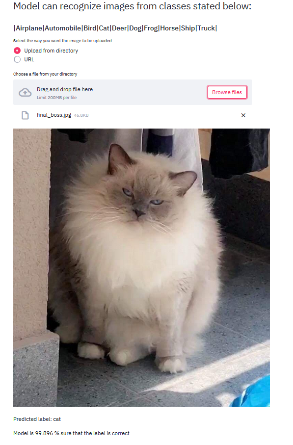
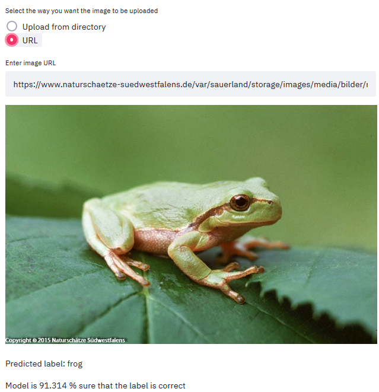

# Streamlit CIFAR10 Image Recognizer
 This is just a simple [Streamlit](https://www.streamlit.io/) app that classifies images. It is based on a pretrained and fine-tuned Resnet18 on CIFAR10 Dataset. It is also my first take with [PyTorch Lightning](https://www.pytorchlightning.ai/).
## Installing the required packages
`pip install -r requirements.txt`
If you are using a Linux operating system you might need to run `pip install torch torchvision`.

## Running the app
`streamlit run main.py`
The script downloads the Resnet checkpoint from Google Drive. If you already have the file, instead run:
`streamlit run main.py -- --download=False`

## App interface
#### You are allowed to either upload a file from directory

#### Or paste a direct URL to an image
